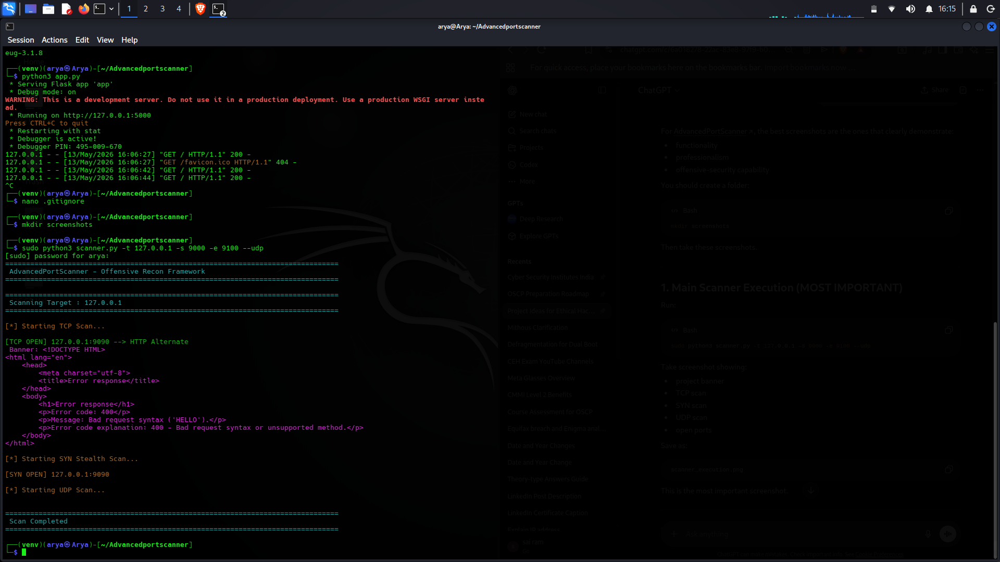
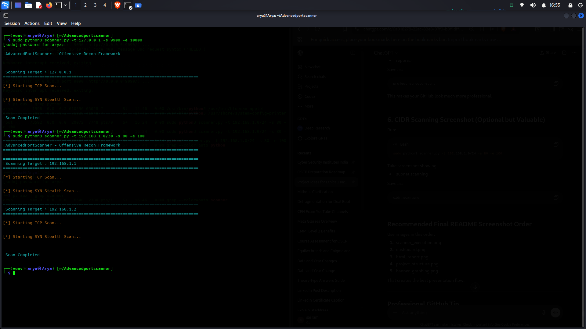
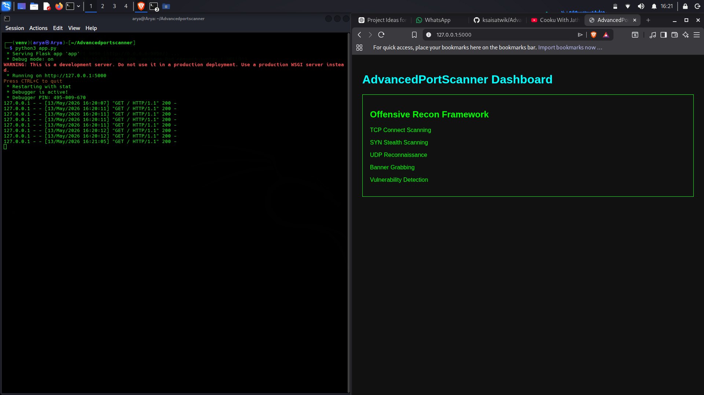
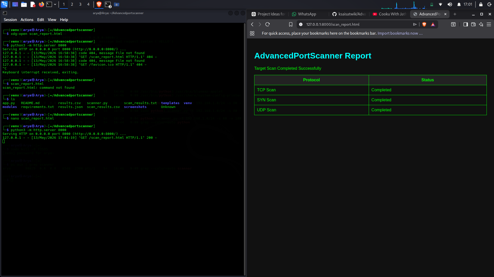
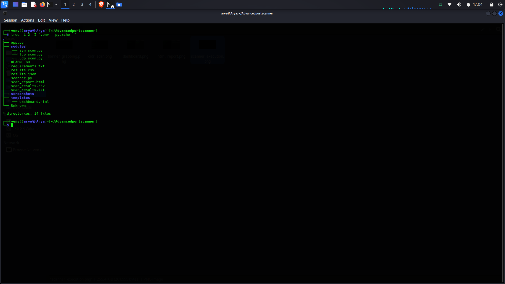
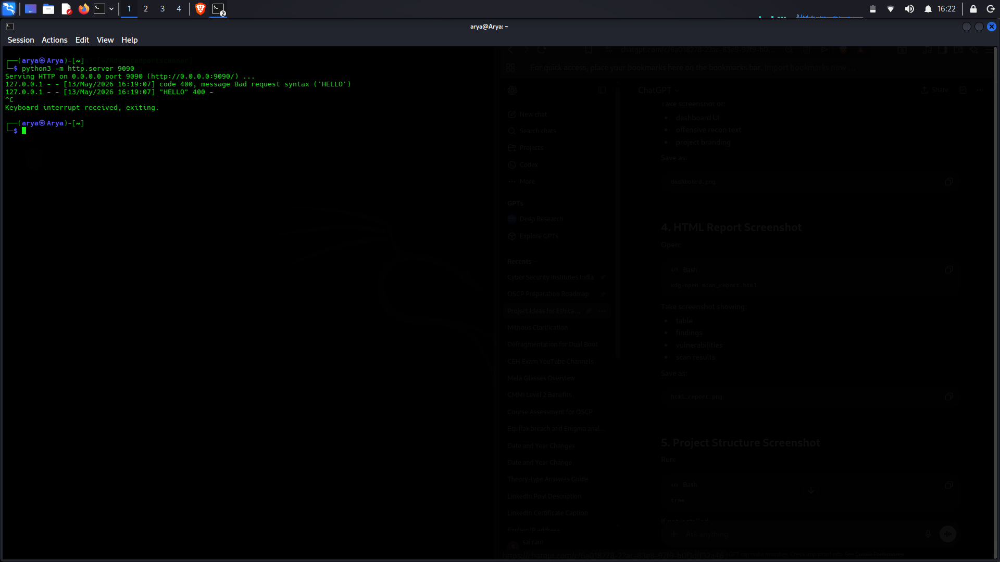

# AdvancedPortScanner

AdvancedPortScanner is a professional offensive reconnaissance and network scanning framework developed using Python.  
The project is designed for cybersecurity learning, red team reconnaissance simulation, and penetration testing practice.

It supports multiple scanning techniques including:

- TCP Connect Scanning
- SYN Stealth Scanning
- UDP Reconnaissance
- Banner Grabbing
- CIDR Network Scanning
- HTML Reporting
- Flask Dashboard Integration

---

# Author

## K SAI SATWIK

---

# Features

- Multi-port TCP scanning
- SYN stealth scanning using Scapy
- UDP reconnaissance scanning
- Banner grabbing and service detection
- CIDR subnet scanning
- HTML report generation
- Flask-based web dashboard
- CSV and JSON result export
- Professional terminal interface
- Modular project architecture

---

# Technologies Used

- Python
- Scapy
- Flask
- Socket Programming
- HTML/CSS
- JSON
- CSV
- Git & GitHub

---

# Project Structure

```bash
.
├── app.py
├── modules
│   ├── syn_scan.py
│   ├── tcp_scan.py
│   └── udp_scan.py
├── README.md
├── requirements.txt
├── results.csv
├── results.json
├── scanner.py
├── scan_report.html
├── scan_results.csv
├── scan_results.txt
├── screenshots
├── templates
│   └── dashboard.html
```

---

# Installation

Clone the repository:

```bash
git clone https://github.com/ksaisatwik/AdvancedPortScanner.git
```

Move into the project directory:

```bash
cd AdvancedPortScanner
```

Create virtual environment:

```bash
python3 -m venv venv
```

Activate virtual environment:

```bash
source venv/bin/activate
```

Install dependencies:

```bash
pip install -r requirements.txt
```

---

# Usage

## TCP + SYN + UDP Scan

```bash
sudo python3 scanner.py -t 127.0.0.1 -s 9900 -e 10000 --udp
```

---

## CIDR Network Scanning

```bash
sudo python3 scanner.py -t 192.168.1.0/30 -s 80 -e 100
```

---

## Start Flask Dashboard

```bash
python3 app.py
```

Open browser:

```text
http://127.0.0.1:5000
```

---

# Screenshots

## Scanner Execution

Demonstrates:
- TCP scanning
- SYN stealth scanning
- UDP reconnaissance
- banner grabbing



---

## CIDR Network Scanning

Demonstrates subnet reconnaissance scanning.



---

## Flask Dashboard

Professional offensive reconnaissance dashboard interface.



---

## HTML Report

Generated HTML scan reporting interface.



---

## Project Structure

Modular architecture of the framework.



---

## Banner Grabbing

Banner grabbing and service fingerprinting demonstration.



---

# Output Files

The scanner automatically generates:

- results.csv
- results.json
- scan_results.csv
- scan_results.txt
- scan_report.html

---

# Educational Purpose

This project is created strictly for:

- cybersecurity learning
- ethical hacking practice
- penetration testing labs
- authorized security assessments

Unauthorized scanning of systems without permission is illegal.

---

# Future Improvements

- Multithreaded scanning
- Vulnerability detection engine
- CVE mapping
- Service fingerprint database
- PDF report generation
- AI-powered anomaly detection
- Real-time dashboard analytics
- OS fingerprinting
- NSE-like scripting engine

---

# License

This project is licensed under the MIT License.

---


